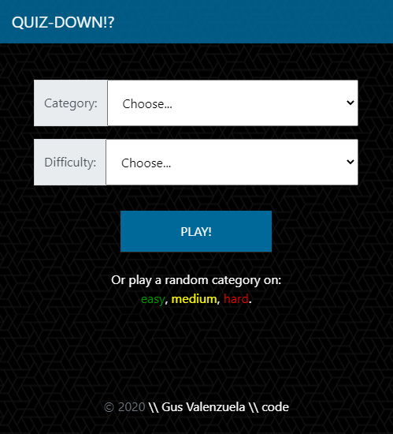
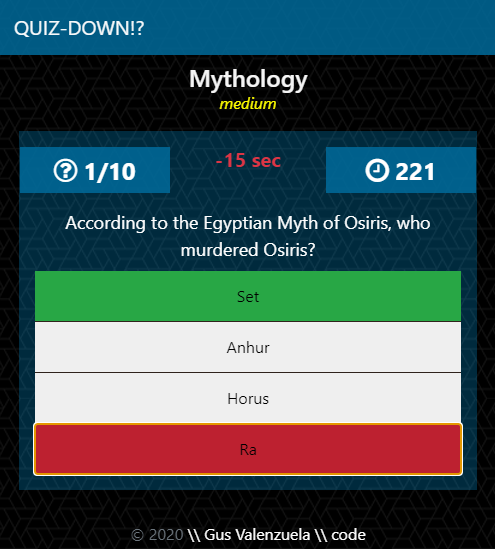

# QUIZDown⁉
> Timed quiz with time penalty for wrong answers and time added for correct ones. Final score is total time left at end of quiz. 

## [PLAY!](https://quiz-down.herokuapp.com/)

## How to Play:
- Choose from one of over 20 categories! Select a difficulty and click PLAY to begin.
- Or, if you're feeling spicy, click on one of the 3 available difficulties to select a category at random.
- A timer will begin and a series of questions will be asked. Answer correctly and you'll be rewarded with an extra 10 seconds on the clock. Get it wrong and you lose 15 seconds! So choose carefully. And watch the clock, once it runs out the quiz is over and you will be awarded 0 points (womp womp). So hurry!
- Have fun!

### Hi Score List

- A final screen appears at the end of the game where you can enter your initials and save the score. You can also view any previous scores ranked highest-to-lowest for the category and difficulty played.

## Built With

* [MongoDB](https://www.mongodb.com/) - NoSQL Database
* [Express.js](https://expressjs.com/) - Node.js framework
* [Node.js](https://nodejs.org/en/) - JavaScript runtime
* [Handlebars.js](https://handlebarsjs.com/) - HTML Rendering
* [NPM](https://www.npmjs.com/) - Dependency management
* [Bootsrap](https://getbootstrap.com/) - CSS framework

## Planned updates

- High-scores page (filterable by category/difficulty)
- Adding T/F questions
- add more sound fx / music

### Copyright 2020 \\ Gus Valenzuela